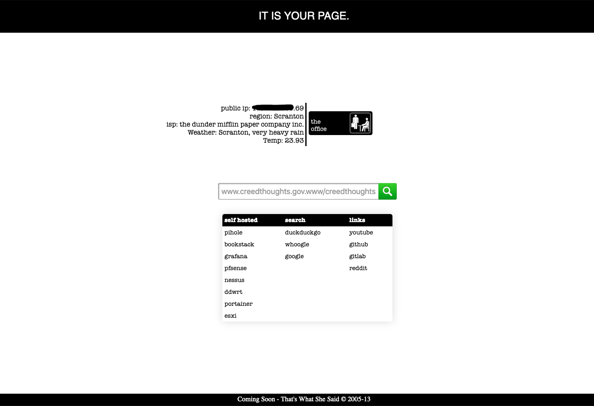

# Startpage
This is a startpage that has the shortcut links to selfhosted services, frequently used sites etc.



### Download files
```sh
git clone git@github.com:scurtyhub/startpage.git
cd startpage/
```
### Set up via Docker
If you haven't already set up Docker. You can set it up [here](https://docs.docker.com/get-docker/)
```sh
docker build -t startpage:latest .
docker run -d -p 9999:9999 startpage:latest
```
Verify the deployment by navigating to your server address in your preferred browser.
```sh
http://<ip address>:9999
```
Now you can set your default home page to your new start page.